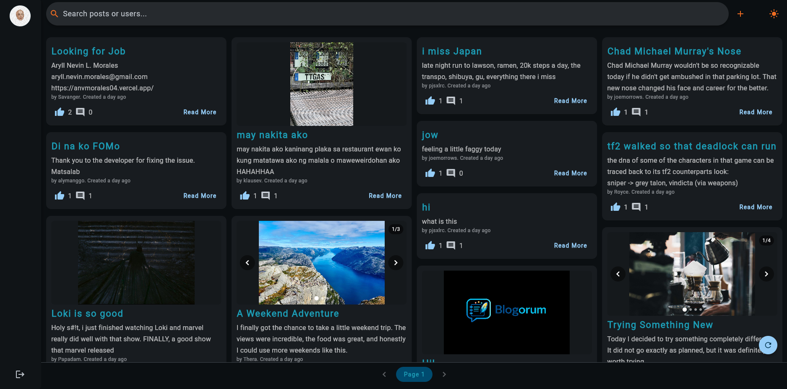
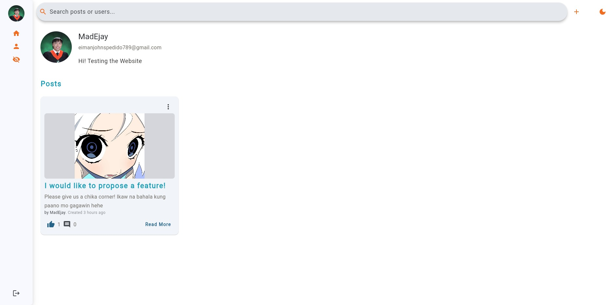
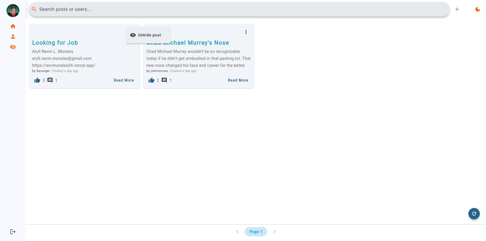
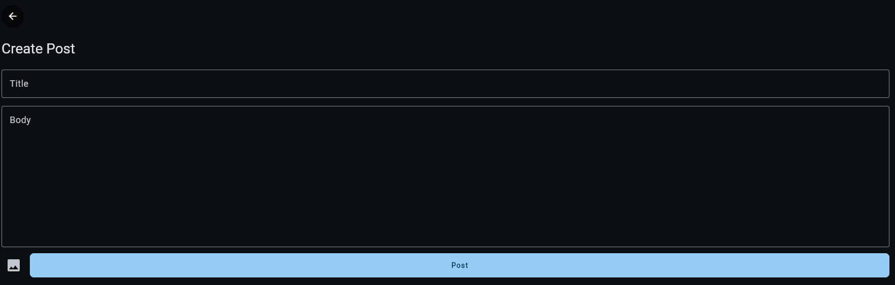
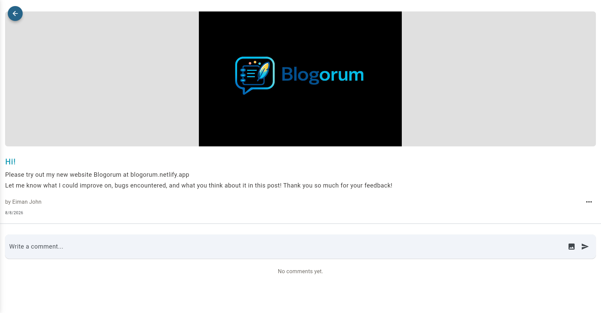
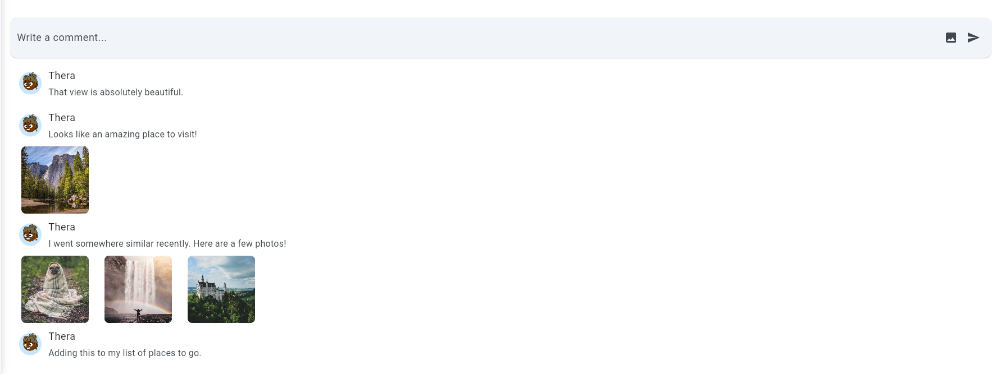
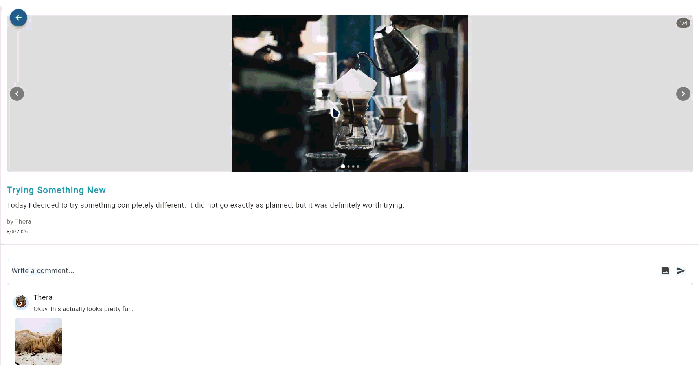

# Blogorum

Blogorum is a forum-style blog website built with Flutter and Supabase. It combines a simple blogging experience with social features such as likes, comments, image uploads, search, user profiles, and post hiding.

**Live Demo:** https://blogorum.netlify.app

## Features

### Authentication
- Sign up and log in
- Forgot password
- Log out
- User profiles

### Posts
- Create posts
- Edit posts
- Delete posts
- Upload multiple images
- Delete images when they are removed from a post
- Paginated feed
- Refresh feed
- Hide and unhide posts
- Post detail pages
- Image galleries with navigation

### Search
- Search posts by title
- Search posts by username

### Likes
- Like and unlike posts
- Display like counts
- Like interactions restricted to logged-in users

### Comments
- Add comments
- Edit comments
- Delete comments
- Upload images with comments
- Display comment counts

### UI
- Responsive web layout
- Light and dark themes
- Sidebar navigation
- Search bar
- Create-post shortcut
- User profile pages
- Post actions menu
- Image galleries with navigation controls

## Screenshots

### Feed — Light Mode


### Feed — Dark Mode



### User Profile



### Hidden Posts



### Create Post



### Post Detail



### Comments



### Comment Interaction Demo



## Tech Stack

| Technology | Purpose |
|---|---|
| Flutter | Frontend framework |
| Dart | Programming language |
| Supabase | Backend platform |
| PostgreSQL | Database |
| Supabase Auth | Authentication |
| Supabase Storage | Image storage |

## Getting Started

### Prerequisites

- Flutter SDK
- Dart SDK
- A Supabase project
- Git

Check your Flutter installation with:

```bash
flutter doctor
```

### Installation

Clone the repository:

```bash
git clone <YOUR_REPOSITORY_URL>
cd blogorum
```

Install dependencies:

```bash
flutter pub get
```

### Supabase Configuration

Blogorum uses Supabase for authentication, database operations, and file storage.

Create a Supabase project and configure the required:

- Database tables
- Row Level Security policies
- Authentication settings
- Storage buckets

Add the project's public configuration to the application as required by the current Flutter setup.

**Never commit Supabase service-role keys, passwords, or other private credentials to the repository.**

## Running the Project

Run the application locally:

```bash
flutter run
```

Run the web version in Chrome:

```bash
flutter run -d chrome
```

Build the production web version:

```bash
flutter build web
```

The production files will be generated in:

```text
build/web/
```

## Database

Supabase PostgreSQL is used to store application data such as:

- User profiles
- Posts
- Comments
- Likes
- Hidden posts

Row Level Security (RLS) policies are used to control access to user-generated content and interactions.

## Current Limitations

- Mobile optimization still needs improvement.
- Search is currently limited to post titles and usernames.
- There are no notifications yet.
- Moderation features are currently limited.

## Planned Features

- Improve mobile responsiveness.
- Improve search functionality, including broader keyword searching.
- Add notifications.
- Add post categories and tags.
- Add more user profile features.
- Add moderation and reporting tools.
- Add forum corner, AKA the chika corner.
- Add notifications to other apps, specifically Discord.

## Development

Before committing changes, run:

```bash
flutter analyze
```

and:

```bash
flutter test
```

It is also recommended to verify the web build:

```bash
flutter build web
```

## Project Status

Blogorum is an actively developed project. The core blogging, authentication, commenting, liking, image upload, search, pagination, post hiding, user profiles, and theme functionality is implemented, while additional polish and features are planned.

## License

This project is currently intended for educational and development purposes.

A formal open-source license can be added if the project is later released for public contribution or redistribution.

---

Built with Flutter and Supabase.
